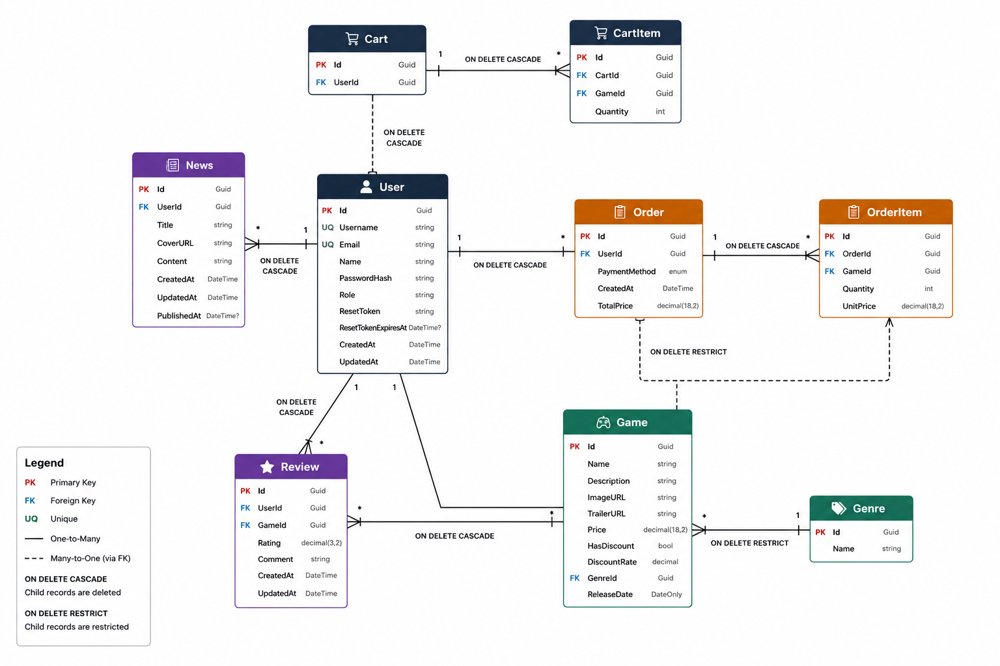

# Game Store API

A backend API for a digital game store. It provides catalog browsing, account management, shopping carts, order creation, game reviews, news publishing, and administrative management endpoints.

## Overview

Game Store API is an ASP.NET Core Web API backed by PostgreSQL. Authenticated customers can manage a personal cart, place orders from its contents, review games, and view their order history. Administrators can manage catalog content, users, news, orders, and reviews through role-protected endpoints.

The application runs Entity Framework Core migrations and seeds the database during startup when the database is available.

## Features

- Registration and login with JWT bearer tokens.
- BCrypt password hashing and authenticated password changes.
- Email-based password reset links with ten-minute token expiry.
- Role-based authorization for administrator operations.
- Game catalog with genres, prices, discounts, release dates, images, trailers, and descriptions.
- Authenticated cart management with quantity updates.
- Order creation from the authenticated user's cart using `CreditCard` or `PayPal`.
- Customer order history and order cancellation within three days of creation.
- Public game reviews, per-game review lists, and average rating summaries.
- News listing and administrator-managed news publishing.
- PostgreSQL persistence with EF Core migrations and startup seed data.
- Configurable CORS for one or more frontend origins.

## Tech Stack

| Area | Technology |
| --- | --- |
| Runtime | .NET 10 / ASP.NET Core Web API |
| Language | C# with nullable reference types enabled |
| Data access | Entity Framework Core 10 |
| Database | PostgreSQL via Npgsql |
| Authentication | JWT bearer authentication |
| Password hashing | BCrypt.Net-Next |
| Email | MailKit and MimeKit over SMTP with STARTTLS |
| Database changes | EF Core migrations |
| Deployment | Docker with the .NET 10 SDK and ASP.NET runtime images |

## Architecture and Project Structure

The project uses a straightforward ASP.NET Core controller-and-service structure. It does not use Clean Architecture or a multi-project architecture.

```text
Game-Store-API/
├── Controllers/          HTTP API controllers and authorization rules
├── Data/                 EF Core DbContext, seeding, and entity configurations
├── Dtos/                 Request and response models grouped by feature
├── Migrations/           EF Core database migrations and model snapshot
├── Models/Entities/      Persistent domain entities and payment enum
├── Services/             SMTP email service and email settings
├── assets/               Project assets, including the ER diagram
├── Program.cs            Dependency injection, middleware, auth, CORS, and startup
├── Dockerfile            Container build and runtime configuration
├── GameStoreApi.csproj   Target framework and NuGet package references
└── test.http             Sample HTTP requests for local development
```

## Database and ER Diagram

The database contains users, games, genres, carts, cart items, orders, order items, reviews, and news. A user has one cart; carts and orders contain game-linked items; games belong to genres and can receive reviews; users can create reviews and news entries.

The EF Core model uses PostgreSQL UUID identifiers, decimal monetary values, `DateOnly` release dates, and UTC timestamps for auditing fields. The application applies the checked-in migration at startup and seeds initial genres, games, and news when the relevant tables are empty.



## Authentication and Security

1. Register with `POST /api/auth/register` or log in with `POST /api/auth/login`.
2. The API returns a JWT containing the user ID, email, username, and role claims.
3. Send the token with protected requests using `Authorization: Bearer YOUR_TOKEN`.
4. JWT issuer, audience, signing key, and lifetime validation are configured from application settings. Tokens currently expire after 1,440 minutes.

Passwords are hashed with BCrypt and are never returned by the API. The password-reset flow generates a random token, stores only its BCrypt hash, expires it after ten minutes, and sends the reset link through the configured SMTP service. Reset links use `FrontendUrl`.

Administrator endpoints require a JWT with the `Admin` role. The implementation currently leaves genre CRUD public and also leaves `PUT /api/user/{id}` without an authorization attribute; review the authorization policy before exposing the API publicly.

## API Endpoints

All routes are relative to the API host. Protected endpoints require a bearer token. `Admin` means a bearer token whose role claim is `Admin`.

### Authentication

| Method | Route | Description | Auth |
| --- | --- | --- | --- |
| `POST` | `/api/auth/register` | Register a user, create their cart, and return a JWT | Public |
| `POST` | `/api/auth/login` | Authenticate by email and password | Public |
| `POST` | `/api/auth/change-password` | Change the authenticated user's password | Bearer |
| `POST` | `/api/auth/forget-password` | Request an email password-reset link | Public |
| `POST` | `/api/auth/reset-password/{userId}/{token}` | Set a new password using a valid reset token | Public with token |

### Games and genres

| Method | Route | Description | Auth |
| --- | --- | --- | --- |
| `GET` | `/api/games` | List games with genre names | Public |
| `GET` | `/api/games/{id}` | Get one game | Public |
| `GET` | `/api/games/{id}/rating` | Get average rating and review count | Public |
| `POST` | `/api/games` | Create a game | Admin |
| `PUT` | `/api/games/{id}` | Update a game | Admin |
| `DELETE` | `/api/games/{id}` | Delete a game | Admin |
| `GET` | `/api/genres` | List genres | Public |
| `GET` | `/api/genres/{id}` | Get one genre | Public |
| `POST` | `/api/genres` | Create a genre | Public |
| `PUT` | `/api/genres/{id}` | Update a genre | Public |
| `DELETE` | `/api/genres/{id}` | Delete a genre | Public |

### Cart and orders

| Method | Route | Description | Auth |
| --- | --- | --- | --- |
| `GET` | `/api/cart/my-cart` | Get the authenticated user's cart | Bearer |
| `POST` | `/api/cart/me/items` | Add a game and quantity to the cart | Bearer |
| `PUT` | `/api/cart/me/items/{itemId}` | Replace a cart-item quantity | Bearer |
| `DELETE` | `/api/cart/me/items/{itemId}` | Remove a cart item | Bearer |
| `POST` | `/api/order/me` | Create an order from the authenticated user's cart | Bearer |
| `GET` | `/api/order/my-orders` | List the authenticated user's orders | Bearer |
| `DELETE` | `/api/order/{id}` | Cancel the authenticated user's order if it is less than three days old | Bearer |
| `GET` | `/api/order` | List all orders | Admin |
| `GET` | `/api/order/{id}` | Get an order by ID | Admin |

### Reviews, news, and users

| Method | Route | Description | Auth |
| --- | --- | --- | --- |
| `GET` | `/api/review` | List reviews | Public |
| `GET` | `/api/review/{id}` | Get a review | Public |
| `GET` | `/api/review/game/{gameId}` | List reviews for a game | Public |
| `POST` | `/api/review` | Create one review per user/game pair | Bearer |
| `PUT` | `/api/review/{id}` | Update the authenticated user's review | Bearer |
| `DELETE` | `/api/review/{id}` | Delete the authenticated user's review | Bearer |
| `DELETE` | `/api/review/admin/{id}` | Delete any review | Admin |
| `GET` | `/api/news` | List news items | Public |
| `GET` | `/api/news/{id}` | Get a news item | Public |
| `POST` | `/api/news` | Create news | Admin |
| `PUT` | `/api/news/{id}` | Update news | Admin |
| `DELETE` | `/api/news/{id}` | Delete news | Admin |
| `GET` | `/api/user` | List users | Admin |
| `GET` | `/api/user/{id}` | Get a user | Admin |
| `POST` | `/api/user` | Create a user record and cart | Admin |
| `PUT` | `/api/user/{id}` | Update a user record | Public in the current implementation |
| `DELETE` | `/api/user/{id}` | Delete a user | Admin |

The root route `GET /` returns `Hello World!` and can be used as a simple process check.

## Configuration

Use .NET User Secrets for local development and environment variables or a platform secret manager in deployment. Do not commit credentials, JWT keys, SMTP passwords, or connection strings.

| Setting | Purpose | Example placeholder |
| --- | --- | --- |
| `ConnectionStrings:GameStore` | PostgreSQL connection string | `Host=YOUR_DATABASE_HOST;Port=5432;Database=YOUR_DATABASE;Username=YOUR_DATABASE_USER;Password=YOUR_DATABASE_PASSWORD` |
| `Jwt:Key` | Symmetric JWT signing key | `YOUR_JWT_SECRET` |
| `Jwt:Issuer` | Expected JWT issuer | `GameStoreApi` |
| `Jwt:Audience` | Expected JWT audience | `GameStoreApi` |
| `EmailSettings:Host` | SMTP host | `smtp.example.com` |
| `EmailSettings:Port` | SMTP port | `587` |
| `EmailSettings:Username` | SMTP username | `YOUR_SMTP_USERNAME` |
| `EmailSettings:Password` | SMTP password | `YOUR_SMTP_PASSWORD` |
| `EmailSettings:From` | Sender address | `no-reply@example.com` |
| `FrontendUrl` | Allowed CORS origin and password-reset link base URL | `http://localhost:5173` |

`FrontendUrl` accepts comma-separated origins, which is useful for a production frontend and preview deployments. For deployment, nested settings use double underscores, for example `ConnectionStrings__GameStore`, `Jwt__Key`, and `EmailSettings__Password`.

Example local setup using User Secrets:

```powershell
dotnet user-secrets set "ConnectionStrings:GameStore" "Host=YOUR_DATABASE_HOST;Port=5432;Database=YOUR_DATABASE;Username=YOUR_DATABASE_USER;Password=YOUR_DATABASE_PASSWORD"
dotnet user-secrets set "Jwt:Key" "YOUR_JWT_SECRET"
dotnet user-secrets set "Jwt:Issuer" "GameStoreApi"
dotnet user-secrets set "Jwt:Audience" "GameStoreApi"
dotnet user-secrets set "FrontendUrl" "http://localhost:5173"
dotnet user-secrets set "EmailSettings:Host" "smtp.example.com"
dotnet user-secrets set "EmailSettings:Port" "587"
dotnet user-secrets set "EmailSettings:Username" "YOUR_SMTP_USERNAME"
dotnet user-secrets set "EmailSettings:Password" "YOUR_SMTP_PASSWORD"
dotnet user-secrets set "EmailSettings:From" "no-reply@example.com"
```

## Getting Started

### Prerequisites

- .NET 10 SDK
- A reachable PostgreSQL database
- SMTP credentials if password-reset email is required

### Run locally

```powershell
git clone <repository-url>
cd Game-Store-API
dotnet restore
# Configure the User Secrets shown above
dotnet run --launch-profile http
```

The HTTP development profile listens on `http://localhost:5183`. On startup, the API applies pending migrations and seeds the initial data set when the database is empty. The checked-in `test.http` file contains sample requests for local testing.

To apply migrations explicitly with the EF CLI, install the tool if needed and run:

```powershell
dotnet tool install --global dotnet-ef
dotnet ef database update
```

## API Usage

### Register and authenticate

```http
POST http://localhost:5183/api/auth/register
Content-Type: application/json

{
	"name": "Alex Player",
	"username": "alexplayer",
	"email": "alex@example.com",
	"password": "YOUR_PASSWORD",
	"confirmPassword": "YOUR_PASSWORD",
	"role": "User"
}
```

The response contains a `token` and a user summary. Use that token for protected requests:

```http
GET http://localhost:5183/api/cart/my-cart
Authorization: Bearer YOUR_TOKEN
```

### Add to cart and create an order

```http
POST http://localhost:5183/api/cart/me/items
Authorization: Bearer YOUR_TOKEN
Content-Type: application/json

{
	"gameId": "00000000-0000-0000-0000-000000000000",
	"quantity": 1
}
```

Create an order from the authenticated cart. The server calculates the total and copies the cart items into the order; `paymentMethod` is `0` for `CreditCard` or `1` for `PayPal`.

```http
POST http://localhost:5183/api/order/me
Authorization: Bearer YOUR_TOKEN
Content-Type: application/json

{
	"paymentMethod": 0
}
```

### Create a review

```http
POST http://localhost:5183/api/review
Authorization: Bearer YOUR_TOKEN
Content-Type: application/json

{
	"rating": 5,
	"comment": "A great game.",
	"gameId": "00000000-0000-0000-0000-000000000000"
}
```

Ratings must be between 1 and 5, and a user can create only one review for a given game.

## Deployment

The included `Dockerfile` uses a multi-stage .NET 10 build and publishes the API in an ASP.NET runtime image. The container listens on port `8080` by default and also honors the platform-provided `PORT` value.

Build and run the image with configuration supplied at runtime:

```powershell
docker build -t game-store-api .
docker run --rm -p 8080:8080 `
	-e ConnectionStrings__GameStore="YOUR_DATABASE_URL" `
	-e Jwt__Key="YOUR_JWT_SECRET" `
	-e Jwt__Issuer="GameStoreApi" `
	-e Jwt__Audience="GameStoreApi" `
	-e FrontendUrl="https://your-frontend.example.com" `
	game-store-api
```

Set the SMTP environment variables as well when password-reset email is enabled. Ensure the deployed database is reachable before the container starts because migrations and seeding run during application startup.

## Future Improvements

- Add automated unit and integration tests for controllers, authorization, and database behavior.
- Add OpenAPI/Swagger documentation and generated client support.
- Move payment processing beyond the current payment-method enum.
- Tighten authorization and input validation for public mutation endpoints.
- Add structured logging, health checks, and production observability.

## License

This project is licensed under the MIT License. See [LICENSE](LICENSE) for the full text.